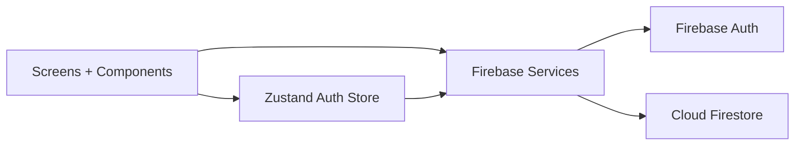
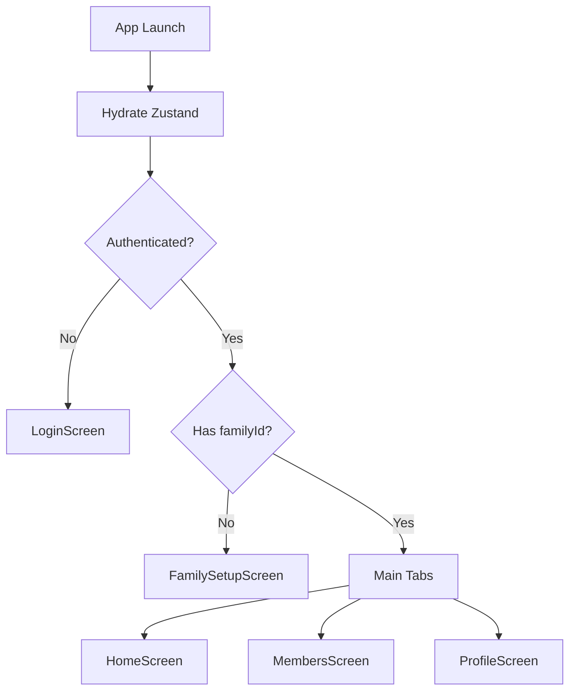

# Family Grocery List

<div align="center">

Shared grocery list app for families with real-time sync, role-based membership, and Firebase auth.

[](https://expo.dev/)
[](https://reactnative.dev/)
[](https://www.typescriptlang.org/)
[](https://firebase.google.com/)
[](https://zustand-demo.pmnd.rs/)
[](https://www.nativewind.dev/)
[](./LICENSE)

</div>

## Overview

Family Grocery List is a React Native app (Expo + native projects) where family members can:

- Sign in with Email/Password or Google.
- Create or join a family using a 6-character invite code.
- Add, edit, complete, and delete grocery items in real time.
- Manage custom categories per family.
- See all family members and share invite codes.

## Contents

- [Tech Stack](#tech-stack)
- [Features](#features)
- [Architecture](#architecture)
- [Project Structure](#project-structure)
- [Getting Started](#getting-started)
- [Environment Variables](#environment-variables)
- [Firebase and Google Setup](#firebase-and-google-setup)
- [Available Scripts](#available-scripts)
- [Firestore Data Model](#firestore-data-model)
- [Auth and Navigation Flow](#auth-and-navigation-flow)
- [Open Source and Contributing](#open-source-and-contributing)
- [Commit Message Rules](#commit-message-rules)
- [Troubleshooting](#troubleshooting)
- [Security Notes](#security-notes)
- [License](#license)

## Tech Stack

| Layer | Tools |
| --- | --- |
| Mobile framework | React Native + Expo (Dev Client / bare workflow) |
| Language | TypeScript |
| Styling | NativeWind (Tailwind CSS for React Native) |
| Code quality | ESLint + Prettier |
| State | Zustand + persisted AsyncStorage |
| Navigation | React Navigation v7 (Native Stack + Bottom Tabs) |
| Backend | Firebase Authentication + Firestore |
| Auth providers | Email/Password, Google OAuth (`expo-auth-session`) |

## Features

- Real-time grocery list sync using Firestore snapshots.
- Pending/completed sections with quick toggle.
- Search by name, category, note, quantity, and author.
- Priority support: `Urgent`, `Medium`, `Low`.
- Category filtering with built-in + custom categories.
- Family membership flow: create family / join by invite code.
- Members screen with shareable invite code.
- Persisted auth session using Zustand + AsyncStorage.
- Defensive auth/service timeouts and readable error messages.

## Architecture



## Project Structure

```text
.
|- App.tsx
|- src/
|  |- components/        # Reusable UI + modals
|  |- screens/           # Login, FamilySetup, Home, Members, Profile
|  |- navigation/        # Root stack + bottom tabs
|  |- services/          # auth, family, grocery, categories, firebaseConfig
|  |- store/             # Zustand store(s)
|  |- features/          # Domain models/helpers (grocery)
|  |- styles/            # NativeWind global css
|  |- theme/             # Design tokens
|  |- types/             # Shared TS types
|- android/              # Native Android project
|- ios/                  # Native iOS project
|- GOOGLE_SIGNIN_SETUP.md
|- .env.example
```

## Getting Started

### 1. Prerequisites

- Node.js `>=20.19.0` (from `package.json` engines)
- npm (or yarn, but scripts are npm-first)
- Android Studio + Android SDK for Android builds
- Xcode + CocoaPods for iOS builds (macOS only)
- Firebase project with Authentication + Firestore enabled

### 2. Install dependencies

```bash
npm install
```

This also installs Git hooks via `husky` (through the `prepare` script).

### 3. Configure environment

```bash
cp .env.example .env
```

Fill `.env` with real Firebase/Google values (see [Environment Variables](#environment-variables)).

### 4. Run the app

```bash
npm run start
```

Use one of:

```bash
npm run android
npm run ios
```

For Expo dev client workflow:

```bash
npm run start:dev
```

## Environment Variables

This app uses Expo public runtime variables (`EXPO_PUBLIC_*`).  
Create `.env` from `.env.example`.

### `.env.example`

```env
EXPO_PUBLIC_FIREBASE_API_KEY=your_firebase_api_key
EXPO_PUBLIC_FIREBASE_AUTH_DOMAIN=your-project-id.firebaseapp.com
EXPO_PUBLIC_FIREBASE_PROJECT_ID=your-project-id
EXPO_PUBLIC_FIREBASE_STORAGE_BUCKET=your-project-id.firebasestorage.app
EXPO_PUBLIC_FIREBASE_MESSAGING_SENDER_ID=123456789012
EXPO_PUBLIC_FIREBASE_APP_ID=1:123456789012:web:abcdef1234567890
EXPO_PUBLIC_FIREBASE_MEASUREMENT_ID=G-XXXXXXXXXX

EXPO_PUBLIC_GOOGLE_WEB_CLIENT_ID=123456789012-xxxxxxxxxxxxxxxxxxxxxxxxxxxxxxxx.apps.googleusercontent.com
EXPO_PUBLIC_GOOGLE_ANDROID_CLIENT_ID=123456789012-xxxxxxxxxxxxxxxxxxxxxxxxxxxxxxxx.apps.googleusercontent.com
EXPO_PUBLIC_GOOGLE_IOS_CLIENT_ID=123456789012-xxxxxxxxxxxxxxxxxxxxxxxxxxxxxxxx.apps.googleusercontent.com
```

### Variable reference

| Variable | Required | Source |
| --- | --- | --- |
| `EXPO_PUBLIC_FIREBASE_API_KEY` | Yes | Firebase project settings -> Web app config |
| `EXPO_PUBLIC_FIREBASE_AUTH_DOMAIN` | Yes | Firebase web config |
| `EXPO_PUBLIC_FIREBASE_PROJECT_ID` | Yes | Firebase web config |
| `EXPO_PUBLIC_FIREBASE_STORAGE_BUCKET` | Yes | Firebase web config |
| `EXPO_PUBLIC_FIREBASE_MESSAGING_SENDER_ID` | Yes | Firebase web config / project number |
| `EXPO_PUBLIC_FIREBASE_APP_ID` | Yes | Firebase web config |
| `EXPO_PUBLIC_FIREBASE_MEASUREMENT_ID` | Optional | Firebase Analytics (web) |
| `EXPO_PUBLIC_GOOGLE_WEB_CLIENT_ID` | Yes | Google Cloud OAuth client (Web) |
| `EXPO_PUBLIC_GOOGLE_ANDROID_CLIENT_ID` | Yes (Android runtime) | Google Cloud OAuth client (Android) |
| `EXPO_PUBLIC_GOOGLE_IOS_CLIENT_ID` | Yes (iOS runtime) | Google Cloud OAuth client (iOS) |

Notes:

- Keep project numbers aligned: Google client IDs must match `EXPO_PUBLIC_FIREBASE_MESSAGING_SENDER_ID`.
- Restart Metro after changing `.env`.
- Never commit real `.env` values.

## Firebase and Google Setup

Use [GOOGLE_SIGNIN_SETUP.md](./GOOGLE_SIGNIN_SETUP.md) for full detail.  
Minimum checklist:

1. Create Firebase project.
2. Enable Authentication providers:
   - Email/Password
   - Google
3. Create Firestore database.
4. Create Google OAuth clients:
   - Web
   - Android (`com.mehedi.FamilyGroceryList` + SHA-1)
   - iOS (`com.mehedi.FamilyGroceryList`)
5. Put client IDs and Firebase config in `.env`.

## Available Scripts

| Script | What it does |
| --- | --- |
| `npm run start` | Start Expo server |
| `npm run start:clear` | Start Expo server with cleared cache |
| `npm run start:dev` | Start Expo dev client server on port `8090` |
| `npm run android` | Build and run Android app (`expo run:android`) |
| `npm run ios` | Build and run iOS app (`expo run:ios --no-bundler`) |
| `npm run ios:dev` | Run iOS build, then start dev client server |
| `npm run web` | Run Expo web |
| `npm run clean` | Reinstall node modules |
| `npm run clean:android` | Clean Android build artifacts |
| `npm run clean:ios` | Clean iOS pods/build and reinstall pods |
| `npm run build:android` | Build Android release APK/AAB via Gradle |
| `npm run lint` | Lint JS/TS code |
| `npm run lint:fix` | Lint and auto-fix where possible |
| `npm run format` | Check formatting under `src/` |
| `npm run format:fix` | Fix formatting under `src/` |

## Firestore Data Model

### `users` collection

| Field | Type | Description |
| --- | --- | --- |
| `uid` | string | Firebase Auth UID |
| `email` | string | User email |
| `displayName` | string | Display name |
| `photoURL` | string | Optional avatar URL |
| `familyId` | string \| null | Current family |
| `role` | `"owner"` \| `"member"` | Family role |
| `updatedAt` | timestamp | Last update |

### `families` collection

| Field | Type | Description |
| --- | --- | --- |
| `id` | string | Family document id |
| `name` | string | Family name |
| `inviteCode` | string | 6-character join code |
| `ownerId` | string | Creator UID |
| `createdAt` | timestamp | Created time |

### `grocery_items` collection

| Field | Type |
| --- | --- |
| `id` | string |
| `familyId` | string |
| `name` | string |
| `category` | string |
| `priority` | `"Urgent"` \| `"Medium"` \| `"Low"` |
| `quantity` | string |
| `notes` | string |
| `status` | `"pending"` \| `"completed"` |
| `addedBy` | `{ uid: string; name: string }` |
| `completedBy` | `{ uid: string; name: string } \| null` |
| `createdAt` | timestamp |
| `updatedAt` | timestamp |
| `completedAt` | timestamp \| null |

### `categories` collection

| Field | Type |
| --- | --- |
| `id` | string |
| `familyId` | string |
| `name` | string |

## Auth and Navigation Flow



## Open Source and Contributing

This project is fully open source and open to all contributors.

- Anyone can fork, improve, and submit pull requests.
- All feature work, fixes, docs, and cleanup contributions are welcome.
- Contribution guide: [CONTRIBUTING.md](./CONTRIBUTING.md)
- Open-source license: [LICENSE](./LICENSE) (MIT)

## Commit Message Rules

All contributors should use the same commit style (Conventional Commits):

`<type>(<scope>): <short summary>`

Allowed `type` values:

- `feat` new feature
- `fix` bug fix
- `docs` documentation-only changes
- `style` formatting/style only (no logic changes)
- `refactor` code restructure (no behavior change)
- `perf` performance improvement
- `test` tests added/updated
- `build` build/dependency updates
- `ci` CI/CD changes
- `chore` maintenance and repo housekeeping
- `revert` revert a previous commit

Rules:

- Keep summary short, imperative, and lowercase.
- Use one logical change per commit.
- Use scope when possible, for example `auth`, `family`, `grocery`, `ui`, `docs`.
- For breaking changes, use `!` and explain in body/footer.

Examples:

- `feat(grocery): add custom category support`
- `fix(auth): handle google token exchange timeout`
- `docs(readme): add contributor workflow`

Enforcement:

- A `commit-msg` Git hook runs `commitlint` automatically on every commit.
- If hooks are missing locally, run:

```bash
npm run prepare
```

## Troubleshooting

### Google sign-in not working

- Confirm all Google client IDs exist in `.env`.
- Confirm client ID project number matches `EXPO_PUBLIC_FIREBASE_MESSAGING_SENDER_ID`.
- Rebuild native app after changing auth config:

```bash
npm run clean:android
npm run android
```

or

```bash
npm run clean:ios
npm run ios
```

### Firestore errors

- `permission-denied`: fix Firestore security rules.
- `requires an index`: create index from Firebase console link in error.
- timeout during family create/join: verify Firestore is created and API enabled.

### Metro or dependency issues

```bash
npm run start:clear
```

If still broken:

```bash
npm run clean
```

## Security Notes

- `.env` is git-ignored; keep it local only.
- `EXPO_PUBLIC_*` values are bundled into client app. Do not place server secrets there.
- Use Firebase Security Rules to protect data access by `familyId` and authenticated user role.

## License

MIT License. See [LICENSE](./LICENSE).
