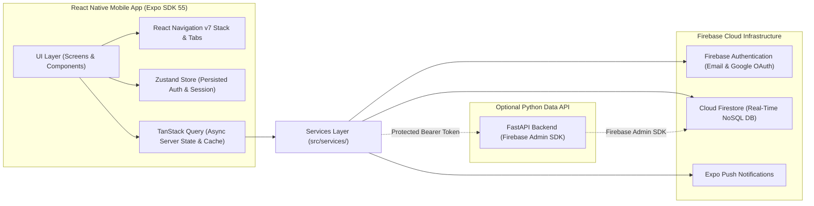
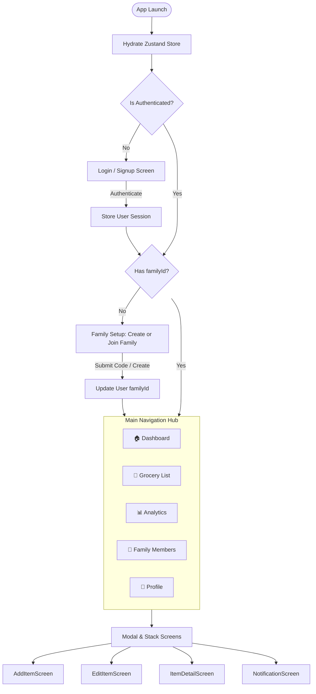
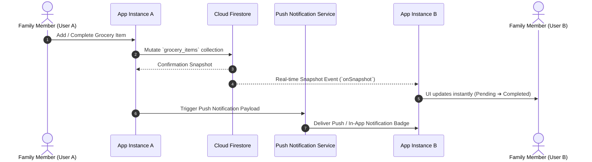

# 🛒 Family Grocery List

<div align="center">


**A modern, real-time family grocery collaboration mobile app built with React Native, Expo SDK 55, Cloud Firestore, Zustand, TanStack Query, and NativeWind.**

[](https://expo.dev/)
[](https://reactnative.dev/)
[](https://reactjs.org/)
[](https://www.typescriptlang.org/)
[](https://firebase.google.com/)
[](https://zustand-demo.pmnd.rs/)
[](https://tanstack.com/query/latest)
[](https://www.nativewind.dev/)
[](./LICENSE)

[Features](#-key-features) • [Tech Stack](#-tech-stack) • [Architecture](#-architecture--data-flow) • [Getting Started](#-getting-started) • [Documentation](#-project-structure)

</div>

---

## 📌 Overview

**Family Grocery List** simplifies household shopping by keeping everyone in sync. Members of a family can create shared lists, assign priority levels, track purchase states, receive real-time notifications, analyze monthly expenditure trends, and explore smart superstore deals—all seamlessly synchronized via Google Firebase Cloud Firestore.

---

## ✨ Key Features

### 🛒 Real-Time Grocery Collaboration

- **Instant Synchronization**: Firestore snapshot listeners ensure instant UI updates across all family devices.
- **Priority Tags**: Highlight urgent purchases (`Urgent`, `High`, `Medium`, `Low`) with visual badges.
- **Smart Categorization**: Organizes items into built-in categories (_Vegetables, Fruits, Dairy, Meat, Fish, Snacks, Drinks, Beauty, Medicine, Household, Other_) or custom family categories.
- **Item Details & Tracking**: Include quantities, estimated prices, notes, and track who added or completed each item.
- **Search & Filters**: Quick-filter by search query, completion status (_Pending / Completed_), priority, or category.

### 👥 Family Management & Invite Code System

- **Quick Setup**: Create a new family workspace or join an existing family with a unique 6-character invite code.
- **Invite Code Sharing**: Easily copy or share family invite codes with family members.
- **Role-Based Membership**: Support for **Owner** and **Member** roles with member activity cards.

### 📊 Smart Expenditure & Analytics Dashboard

- **Monthly Spending Breakdown**: Track monthly spending totals and completion ratios.
- **Category Insights**: Visual charts powered by `react-native-gifted-charts` detailing top expense categories.
- **Status Metrics**: View completed vs. pending items at a glance on the interactive Dashboard.

### 🔔 Real-Time & Push Notifications

- **Activity Alerts**: Instant push notifications via `expo-notifications` for newly added items, completed items, or urgent requests.
- **In-App Notification Center**: Dedicated notification history view with unread badges and batch mark-as-read options.

### 🏪 Superstore & Deal Suggestions

- **Smart Recommendations**: Integrated Superstore service suggesting deals, trending items, and store comparisons.

### 🔒 Secure Authentication & Profile Setup

- **Multi-Method Auth**: Sign in with Email/Password or Google OAuth (`@react-native-google-signin/google-signin` with `expo-auth-session` fallback).
- **Session Persistence**: Persistent auth and user state powered by Zustand with `@react-native-async-storage/async-storage`.
- **Profile Customization**: Update display names, avatars, and security preferences.

---

## 🛠 Tech Stack

| Layer                  | Technology                                                                              | Version              | Purpose                                                 |
| :--------------------- | :-------------------------------------------------------------------------------------- | :------------------- | :------------------------------------------------------ |
| **Mobile Core**        | [Expo SDK](https://expo.dev/)                                                           | `~55.0.28`           | Cross-platform dev client & native build runner         |
| **Runtime**            | [React Native](https://reactnative.dev/)                                                | `0.83.6`             | Native UI runtime engine                                |
| **UI Library**         | [React](https://reactjs.org/)                                                           | `19.2.0`             | Declarative UI framework                                |
| **Language**           | [TypeScript](https://www.typescriptlang.org/)                                           | `~5.9.3`             | Type safety and strict interface definitions            |
| **Styling**            | [NativeWind](https://www.nativewind.dev/)                                               | `^4.2.6`             | Utility-first Tailwind CSS styling for React Native     |
| **Icons & Fonts**      | [Lucide React Native](https://lucide.dev/)                                              | `^1.27.0`            | Modern SVG icon set                                     |
| **Typography**         | [Google Fonts](https://fonts.google.com/)                                               | `@expo-google-fonts` | DM Sans & DM Mono custom typography                     |
| **State Management**   | [Zustand](https://zustand-demo.pmnd.rs/)                                                | `^5.0.14`            | Global state store with AsyncStorage persistence        |
| **Server State**       | [TanStack Query](https://tanstack.com/query/latest)                                     | `^5.101.4`           | Server state caching, background refetching & mutations |
| **Navigation**         | [React Navigation](https://reactnavigation.org/)                                        | `^7.0.0`             | Type-safe Native Stack & Bottom Tab navigation          |
| **Backend & DB**       | [Firebase](https://firebase.google.com/)                                                | `^12.16.0`           | Auth & Cloud Firestore real-time database               |
| **Charts**             | [Gifted Charts](https://github.com/Abhinandan-Kushwaha/react-native-gifted-charts)      | `^1.4.77`            | Native SVG analytical charts                            |
| **Forms & Validation** | [React Hook Form](https://react-hook-form.com/) + [Yup](https://github.com/jquense/yup) | `^7.83.0` / `^1.7.1` | Performant form management with schema validation       |
| **Notifications**      | [Expo Notifications](https://docs.expo.dev/versions/latest/sdk/notifications/)          | `~55.0.25`           | Local & remote push notification handling               |
| **Optional Backend**   | [FastAPI](https://fastapi.tiangolo.com/)                                                | Python 3.10+         | Server-side data API with Firebase Admin SDK            |
| **Testing**            | [Vitest](https://vitest.dev/)                                                           | `^4.1.10`            | Fast unit testing engine with v8 coverage               |
| **Lint & Quality**     | ESLint + Prettier + Husky + Commitlint                                                  | Latest               | Code formatting, linting, and git commit enforcement    |

---

## 🏗 Architecture & Data Flow

### System Architecture


```mermaid
flowchart LR
    subgraph Client ["React Native Mobile App (Expo SDK 55)"]
        UI["UI Layer (Screens & Components)"]
        Nav["React Navigation v7 Stack & Tabs"]
        State["Zustand Store (Persisted Auth & Session)"]
        Query["TanStack Query (Async Server State & Cache)"]
    end

    subgraph Firebase ["Firebase Cloud Infrastructure"]
        Auth["Firebase Authentication (Email & Google OAuth)"]
        Firestore["Cloud Firestore (Real-Time NoSQL DB)"]
        FCM["Expo Push Notifications"]
    end

    subgraph OptionalBackend ["Optional Python Data API"]
        FastAPI["FastAPI Backend (Firebase Admin SDK)"]
    end

    UI --> Nav
    UI --> State
    UI --> Query
    Query --> Services["Services Layer (src/services/)"]
    Services --> Auth
    Services --> Firestore
    Services --> FCM
    Services -. Protected Bearer Token .-> FastAPI
    FastAPI -. Firebase Admin SDK .-> Firestore
```

### Auth & Navigation Control Flow


```mermaid
flowchart TD
    Launch([App Launch]) --> Hydrate[Hydrate Zustand Store]
    Hydrate --> CheckAuth{Is Authenticated?}

    CheckAuth -- No --> LoginScreen[Login / Signup Screen]
    LoginScreen -- Authenticate --> SaveAuth[Store User Session] --> CheckFamily

    CheckAuth -- Yes --> CheckFamily{Has familyId?}

    CheckFamily -- No --> FamilySetupScreen[Family Setup: Create or Join Family]
    FamilySetupScreen -- Submit Code / Create --> UpdateUser[Update User familyId] --> MainTabs

    CheckFamily -- Yes --> MainTabs["Main App Tab Navigator"]

    subgraph MainTabs ["Main Navigation Hub"]
        DashboardTab["🏠 Dashboard"]
        GroceriesTab["🛒 Grocery List"]
        AnalyticsTab["📊 Analytics"]
        FamilyTab["👥 Family Members"]
        ProfileTab["👤 Profile"]
    end

    MainTabs --> StackScreens["Modal & Stack Screens"]
    StackScreens --> AddItem["AddItemScreen"]
    StackScreens --> EditItem["EditItemScreen"]
    StackScreens --> ItemDetail["ItemDetailScreen"]
    StackScreens --> Notifications["NotificationScreen"]
```

### Real-Time Sync & Notification Engine


```mermaid
sequenceDiagram
    autonumber
    actor UserA as Family Member (User A)
    participant AppA as App Instance A
    participant Firestore as Cloud Firestore
    participant NotifService as Push Notification Service
    participant AppB as App Instance B
    actor UserB as Family Member (User B)

    UserA->>AppA: Add / Complete Grocery Item
    AppA->>Firestore: Mutate `grocery_items` collection
    Firestore-->>AppA: Confirmation Snapshot
    Firestore-->>AppB: Real-time Snapshot Event (`onSnapshot`)
    AppB->>UserB: UI updates instantly (Pending ➔ Completed)

    AppA->>NotifService: Trigger Push Notification Payload
    NotifService->>AppB: Deliver Push / In-App Notification Badge
```

---

## 📁 Project Structure

```text
Family-Grocery-List/
├── .github/                  # GitHub Issue/PR templates, CI workflows
├── android/                  # Native Android platform project
├── ios/                      # Native iOS platform project (macOS only)
├── backend/                  # Optional Python FastAPI data backend service
├── docs/                     # Additional architectural & setup documentation
├── src/                      # Source code directory
│   ├── components/           # Presentational and reusable UI components
│   │   ├── skeletons/        # Loading skeleton components
│   │   └── ui/               # Reusable primitives (RhfTextfield, Buttons, Cards)
│   ├── constants/            # App constants, Query keys (query-keys.ts)
│   ├── features/             # Feature domain models, helpers, or hooks
│   ├── hooks/                # Custom React hooks
│   │   └── queries/          # TanStack Query custom hooks (useGroceryQueries, etc.)
│   ├── lib/                  # Library wrappers (firebase, etc.)
│   ├── models/               # Data model interfaces (grocery, user, family, notification)
│   ├── navigation/           # React Navigation configuration (Routes, Navigators)
│   ├── screens/              # Main application screens
│   │   ├── AddItemScreen.tsx
│   │   ├── AnalyzeScreen.tsx
│   │   ├── DashboardScreen.tsx
│   │   ├── EditItemScreen.tsx
│   │   ├── EditProfileScreen.tsx
│   │   ├── FamilySetupScreen.tsx
│   │   ├── GroceryListScreen.tsx
│   │   ├── HelpSupportScreen.tsx
│   │   ├── ItemDetailScreen.tsx
│   │   ├── LoadingScreen.tsx
│   │   ├── LoginScreen.tsx
│   │   ├── MembersScreen.tsx
│   │   ├── NotificationScreen.tsx
│   │   ├── PrivacySecurityScreen.tsx
│   │   └── ProfileScreen.tsx
│   ├── services/             # API & Firebase interaction logic
│   │   ├── auth/             # Firebase Authentication services
│   │   ├── family/           # Family & member services
│   │   ├── grocery.ts        # Firestore grocery CRUD & realtime listener
│   │   ├── notification.ts   # In-app notifications service
│   │   ├── pushNotificationService.ts # Push notification setup & registration
│   │   └── firebaseConfig.ts # Firebase SDK initialization
│   ├── store/                # Zustand global state stores (useAuthStore, etc.)
│   ├── styles/               # NativeWind global CSS and tailwind styles
│   ├── theme/                # Color palettes, typography, design tokens
│   ├── types/                # Shared TypeScript types & Navigation Param Lists
│   └── utils/                # Pure helper utilities, formatters, and RHF validation schemas
├── App.tsx                   # Main React Native Application Root Entry
├── app.json                  # Expo configuration file
├── babel.config.js           # Babel preset configuration
├── commitlint.config.cjs     # Conventional commit rules
├── eslint.config.cjs         # ESLint configuration
├── firestore.rules           # Cloud Firestore Security Rules
├── index.ts                  # App register entry point
├── metro.config.js           # Metro bundler configuration
├── package.json              # Dependencies and NPM scripts
├── tailwind.config.js        # Tailwind CSS design tokens and NativeWind config
├── tsconfig.json             # TypeScript config
└── vitest.config.ts          # Vitest unit test runner config
```

---

## 🚀 Getting Started

### 1. Prerequisites

Ensure your environment meets the following requirements:

- **Node.js**: `>=22.12.0` (LTS recommended)
- **Package Manager**: `yarn` or `npm` (Yarn `1.22+` recommended)
- **iOS Development** (macOS only): Xcode 15+, CocoaPods
- **Android Development**: Android Studio, JDK 17, Android SDK & Emulator
- **Firebase Project**: Created with Authentication (Email/Password, Google) & Cloud Firestore enabled

---

### 2. Installation & Setup

1. **Clone the Repository**

   ```bash
   git clone https://github.com/mehedihassandev/Family-Grocery-List.git
   cd Family-Grocery-List
   ```

2. **Install Dependencies**

   ```bash
   yarn install
   # or
   npm install
   ```

   _Note: Running `install` automatically initializes Husky git hooks via the `prepare` script._

3. **Configure Environment Variables**
   Create a `.env` file in the project root based on `.env.example`:
   ```bash
   cp .env.example .env
   ```

---

## 🔑 Environment Variables Reference

Populate `.env` with your Firebase project credentials and Google OAuth client IDs:

```env
# Firebase Client SDK Configuration
EXPO_PUBLIC_FIREBASE_API_KEY=AIzaSy...
EXPO_PUBLIC_FIREBASE_AUTH_DOMAIN=your-app.firebaseapp.com
EXPO_PUBLIC_FIREBASE_PROJECT_ID=your-app-id
EXPO_PUBLIC_FIREBASE_STORAGE_BUCKET=your-app.firebasestorage.app
EXPO_PUBLIC_FIREBASE_MESSAGING_SENDER_ID=123456789012
EXPO_PUBLIC_FIREBASE_APP_ID=1:123456789012:web:abcdef1234567890
EXPO_PUBLIC_FIREBASE_MEASUREMENT_ID=G-XXXXXXXXXX

# Google OAuth Client Credentials
EXPO_PUBLIC_GOOGLE_WEB_CLIENT_ID=123456789012-xxx.apps.googleusercontent.com
EXPO_PUBLIC_GOOGLE_ANDROID_CLIENT_ID=123456789012-xxx.apps.googleusercontent.com
EXPO_PUBLIC_GOOGLE_IOS_CLIENT_ID=123456789012-xxx.apps.googleusercontent.com

# Optional Python Backend API
EXPO_PUBLIC_DATA_API_BASE_URL=http://127.0.0.1:8000
```

| Variable                                   |  Required  | Description                                     |
| :----------------------------------------- | :--------: | :---------------------------------------------- |
| `EXPO_PUBLIC_FIREBASE_API_KEY`             |  **Yes**   | Firebase Web App API Key                        |
| `EXPO_PUBLIC_FIREBASE_AUTH_DOMAIN`         |  **Yes**   | Firebase Auth Domain                            |
| `EXPO_PUBLIC_FIREBASE_PROJECT_ID`          |  **Yes**   | Firebase Project ID                             |
| `EXPO_PUBLIC_FIREBASE_STORAGE_BUCKET`      |  **Yes**   | Firebase Storage Bucket URL                     |
| `EXPO_PUBLIC_FIREBASE_MESSAGING_SENDER_ID` |  **Yes**   | Firebase Messaging Sender ID / Sender Number    |
| `EXPO_PUBLIC_FIREBASE_APP_ID`              |  **Yes**   | Firebase App Identification String              |
| `EXPO_PUBLIC_GOOGLE_WEB_CLIENT_ID`         |  **Yes**   | Google OAuth Web Client ID                      |
| `EXPO_PUBLIC_GOOGLE_ANDROID_CLIENT_ID`     |  **Yes**   | Google OAuth Android Client ID (Native Android) |
| `EXPO_PUBLIC_GOOGLE_IOS_CLIENT_ID`         |  **Yes**   | Google OAuth iOS Client ID (Native iOS)         |
| `EXPO_PUBLIC_DATA_API_BASE_URL`            | _Optional_ | Python FastAPI backend endpoint URL             |

> [!NOTE]
> Always restart the Metro bundler after editing `.env` files for variables to take effect.

---

### 3. Running the Application

Start the Expo Metro bundler:

```bash
yarn start
# or
npm run start
```

#### Run on Mobile Platforms:

```bash
# Run on Android Emulator or Connected Device
yarn android

# Run on iOS Simulator (macOS only)
yarn ios
```

#### Run Expo Development Client:

```bash
yarn start:dev
```

#### Run on Web:

```bash
yarn web
```

---

## 🔥 Firebase & Google OAuth Setup

For detailed step-by-step setup guides, refer to:

- 📖 [FIRESTORE_RULES_SETUP.md](./FIRESTORE_RULES_SETUP.md) — Deploying Cloud Firestore security rules.
- 📖 [GOOGLE_SIGNIN_SETUP.md](./GOOGLE_SIGNIN_SETUP.md) — Registering SHA-1 fingerprints & Google OAuth clients.

### Quick Firebase Checklist:

1. Enable **Authentication**: Enable `Email/Password` and `Google` sign-in providers.
2. Provision **Firestore Database**: Start in production mode and apply `firestore.rules`.
3. Configure **SHA-1 Fingerprint**: Add your Android debug/release keystore SHA-1 fingerprint into Firebase Console.

---

## 🐍 Optional Python Data Backend

The workspace includes a high-performance **FastAPI** backend under `backend/` for server-side analytics, token verification, and data manipulation.

### Setup Backend:

```bash
cd backend
python3 -m venv .venv
source .venv/bin/activate
pip install -e ".[dev]"
uvicorn app.main:app --reload --port 8000
```

Configure `backend/.env`:

```env
FIREBASE_PROJECT_ID=your-project-id
FIREBASE_SERVICE_ACCOUNT_JSON=/path/to/service-account.json
ALLOWED_ORIGINS=http://localhost:8081,http://localhost:19006
```

---

## 🗄 Firestore Data Schema

### 👤 `users` Collection

```json
{
  "uid": "string (Firebase Auth UID)",
  "email": "string",
  "displayName": "string",
  "photoURL": "string | null",
  "familyId": "string | null",
  "role": "owner | member",
  "updatedAt": "timestamp"
}
```

### 👨‍👩‍👧‍👦 `families` Collection

```json
{
  "id": "string (Document ID)",
  "name": "string",
  "inviteCode": "string (6-character unique code)",
  "ownerId": "string (UID of creator)",
  "createdAt": "timestamp"
}
```

### 🛒 `grocery_items` Collection

```json
{
  "id": "string",
  "familyId": "string",
  "name": "string",
  "category": "Beauty | Meat | Fish | Vegetables | Fruits | Dairy | Snacks | Drinks | Household | Medicine | Other",
  "priority": "Urgent | High | Medium | Low",
  "quantity": "string",
  "notes": "string",
  "status": "pending | completed",
  "addedBy": { "uid": "string", "name": "string" },
  "completedBy": { "uid": "string", "name": "string" } | null,
  "createdAt": "timestamp",
  "updatedAt": "timestamp",
  "completedAt": "timestamp | null"
}
```

### 🔔 `notifications` Collection

```json
{
  "id": "string",
  "familyId": "string",
  "type": "item_added | item_completed | urgent_item",
  "title": "string",
  "message": "string",
  "actorId": "string",
  "actorName": "string",
  "itemId": "string",
  "itemName": "string",
  "readBy": ["string (UID array)"],
  "createdAt": "timestamp"
}
```

---

## 📜 Available NPM Scripts

| Command                  | Description                                                 |
| :----------------------- | :---------------------------------------------------------- |
| `yarn start`             | Launches the Expo Metro bundler                             |
| `yarn start:clear`       | Starts Expo with a cleared cache                            |
| `yarn start:dev`         | Starts Expo Dev Client on custom port `8090`                |
| `yarn android`           | Builds and runs the native Android app                      |
| `yarn ios`               | Builds and runs the native iOS app                          |
| `yarn web`               | Starts Expo web developer server                            |
| `yarn clean`             | Cleans `node_modules` and reinstalls dependencies           |
| `yarn clean:android`     | Executes Gradle clean and clears Android native build cache |
| `yarn clean:ios`         | Cleans iOS `Pods`, `Podfile.lock`, and reinstalls CocoaPods |
| `yarn build:android`     | Generates a production release Android APK                  |
| `yarn build:android:aab` | Generates a production release Android App Bundle (AAB)     |
| `yarn lint`              | Runs ESLint code inspection across the project              |
| `yarn lint:fix`          | Automatically fixes ESLint warnings and errors              |
| `yarn format`            | Checks source code formatting with Prettier                 |
| `yarn format:fix`        | Formats all source files under `src/` with Prettier         |
| `yarn test`              | Runs unit tests using Vitest                                |
| `yarn test:coverage`     | Generates unit test code coverage report                    |
| `yarn type-check`        | Runs static TypeScript compiler check (`tsc --noEmit`)      |

---

## 🧪 Testing & Code Quality

### Running Tests

```bash
# Run unit tests
yarn test

# Run tests with watch mode
yarn test:watch

# Generate coverage output
yarn test:coverage
```

### Commit Message Rules

This repository enforces **Conventional Commits** via `commitlint` and `husky`. Commits must follow the format:

```text
<type>(<scope>): <short summary>
```

#### Valid Types:

- `feat`: New feature added
- `fix`: Bug fix
- `docs`: Documentation updates
- `style`: Formatting or code style changes (no logic changes)
- `refactor`: Code restructuring without functional changes
- `perf`: Performance improvement
- `test`: Unit or integration test additions/updates
- `build`: Dependency or build configuration updates
- `ci`: CI/CD pipeline changes
- `chore`: Repository maintenance tasks

#### Examples:

- `feat(grocery): add priority badges and custom category support`
- `fix(auth): fix google oauth token refresh delay`
- `docs(readme): modernize project documentation`

---

## 🔧 Troubleshooting

<details>
<summary><b>Google Sign-In Returns Developer Error</b></summary>

- Ensure `EXPO_PUBLIC_GOOGLE_ANDROID_CLIENT_ID` and `EXPO_PUBLIC_GOOGLE_IOS_CLIENT_ID` in `.env` match your Google Cloud Console OAuth 2.0 Client IDs.
- Verify that your Android debug keystore SHA-1 fingerprint is registered in the Firebase Console.
- Rebuild native binary after updating environment credentials (`yarn clean:android && yarn android`).

</details>

<details>
<summary><b>Cloud Firestore Permission Denied</b></summary>

- Deploy the rules defined in `firestore.rules` to your Firebase Console.
- Ensure the user is signed in and has a valid `familyId` attached to their user document in Firestore.

</details>

<details>
<summary><b>Metro Bundler or Cache Issues</b></summary>

- Reset Metro cache: `yarn start:clear`
- Reset dependencies completely: `yarn clean`

</details>

---

## 🔒 Security & Privacy

- **Environment Secrets**: Never commit `.env` or sensitive Firebase service accounts into public repositories.
- **Client Security**: Values prefixed with `EXPO_PUBLIC_*` are bundled into the mobile app binary. Server secrets belong strictly in backend microservices.
- **Data Protection**: User data is isolated per family using strict Firestore security rules.

---

## 📄 License & Contribution

Distributed under the **MIT License**. See [`LICENSE`](./LICENSE) for details.

Contributions, bug reports, and feature requests are welcome! Please review our [Contributing Guidelines](./CONTRIBUTING.md) and [Code of Conduct](./CODE_OF_CONDUCT.md).

<div align="center">

Made with ❤️ by [Mehedi Hassan](https://github.com/mehedihassandev) and community contributors.

</div>
